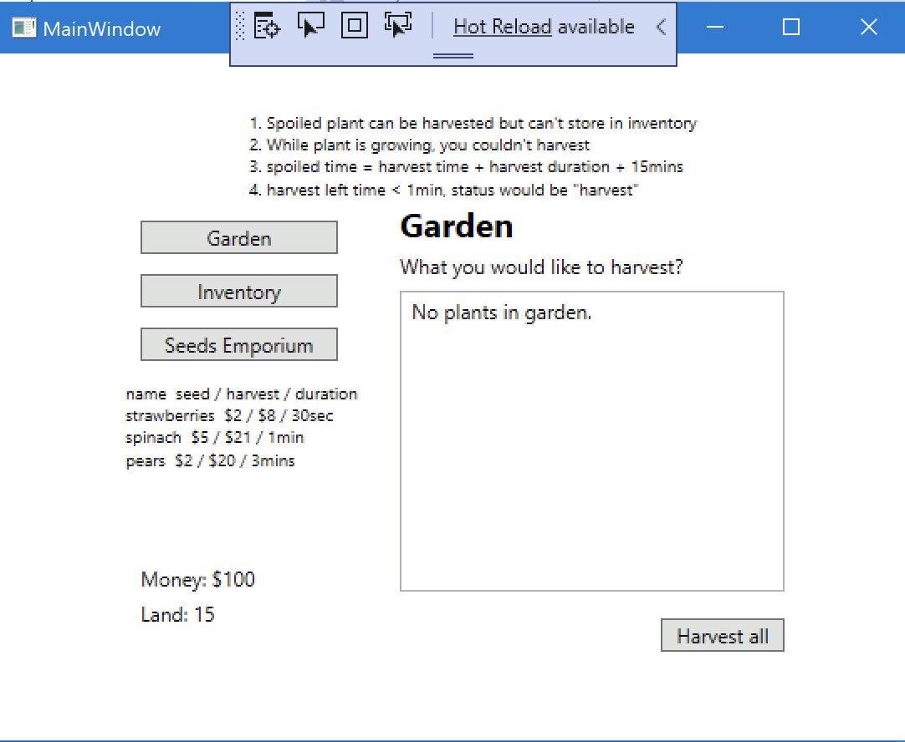
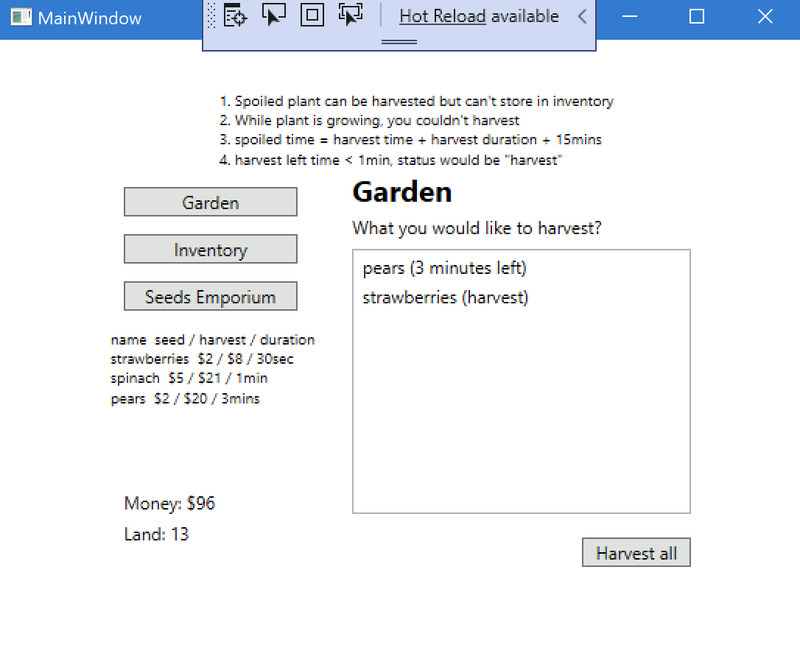
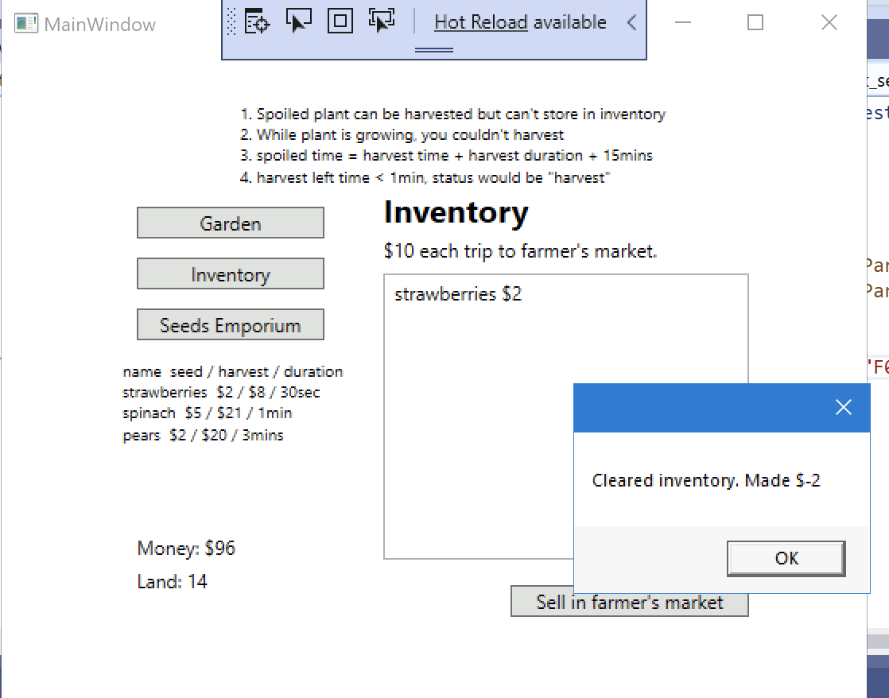

# Plantville 

> Introduction: This repository is for the Week 8(branch: `main`) and final(branch: `final`) project in C#II Spring 2023 Course for Windows Presentation Foundation(WPF) application.

## How It Works
The main folder for the project is located at `/RLinPlantville`. You can find the relevant code in the file `Plantville_CSharp/RLinPlantville/RLinPlantville/MainWindow.xaml.cs`.

```shell
git clone git@github.com:qawsedr87/Plantville-CSharp-WPF.git

cd Plantville-CSharp-WPF/RLinPlantville
```

The project was developed using Visual Studio 2019. You also can execute [RLinPlantville.exe](https://github.com/qawsedr87/Plantville-CSharp-WPF/tree/main/RLinPlantville/RLinPlantville/bin/Debug) on Window OS.

## Screenshots

start


garden 


sell 


## Details 

We are going to create a game that will revolutionize the industry. We'll play as a farmer who buys seeds, waits for them to harvest, then reap the rewards! <a id="raw-url" href="https://github.com/qawsedr87/Plantville_CSharp/example/Plantville.exe">Give it a whirl</a> then create it on your own.

### Features
1. Players start with $100
2. Players start with 15 land plots. This means they can grow 15 plants at one time.
3. Each menu button displays a different body: Seed emporium, garden, and inventory
4. Status bar (money and land plots) should be updated on any change.
5. Seed emporium 
    - Displays the list of seeds available for sale. This data should be stored in one place only, the seed_list (look below at Code requirements #3). This means we should be able to fully control the seeds available from that list. 
    - Players can only buy seeds if they have enough money and available land plots.
    - When you purchase a seed, it automatically gets planted into your garden
6. Garden
    - Print message "No plants in garden" if empty.
    - Display the plants and how long they have until they can be harvested.
    - If a plant isn't harvested 15 min after it's ready, then it spoils on the vine.
    - When you harvest a plant, it goes into your inventory. 
    - Double click each plant to harvest individually. Harvest all button pulls all plants that are ready.
7. Inventory
    - Build up fruits and vegetables in your inventory.
    - You can sell your inventory by going to the farmer's market, but it costs $10 to set up a booth, regardless of how many items you sell. 
    - Warn player if they try to go to the farmer's market without any product to sell.
    - Print empty message if empty.
8. Saving state
    - If there's no data file, then load player with default stats.
    - If there's a data file, then load stats from file. Load these stats:
        - Amount of money they have
        - What is in their inventory.
        - What is in their garden.
    - Player's current state saves to a file when the game closes.
9. Seeds - These plants are available at the Emporium:
    - Strawberries
        - Seed price $2
        - Harvest price $8
        - 30 seconds to harvest
    - Spinach
        - Seed price $5
        - Harvest price $21
        - 1 min to harvest
    - Pears
        - Seed price $2
        - Harvest price $20
        - 3 minutes to harvest


### Code requirements
For the most part, you're free to code it how you want. Just be sure to implement these things in your code.

1. Seed class - use it to create seed objects.
2. Plant class - use it to create plant objects. 
3. Seed emporium's seeds must be populated from a List of Seeds. It should look something like this:

```csharp
List<Seed> seed_list = new List<Seed>() {
     new Seed(*TODO*),
     new Seed(*TODO*),
     new Seed(*TODO*)
};
```

### Due dates and milestones
You have two weeks to complete this project. Try completing the Garden and Seed Emporium sections first.

### Optional: Hard mode
Great developers can look at a project of any size and break it into small pieces. There's some real skill in this class. If you want to do this on hard mode, build the project without cheats. The [cheat sheet page](/example/CHEAT_SHEET.md) gives suggestions on build order and breaks the project into smaller pieces.
